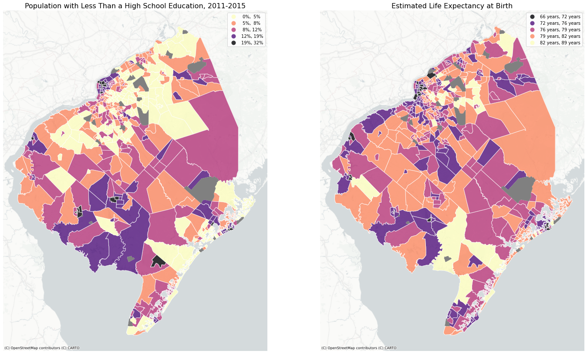
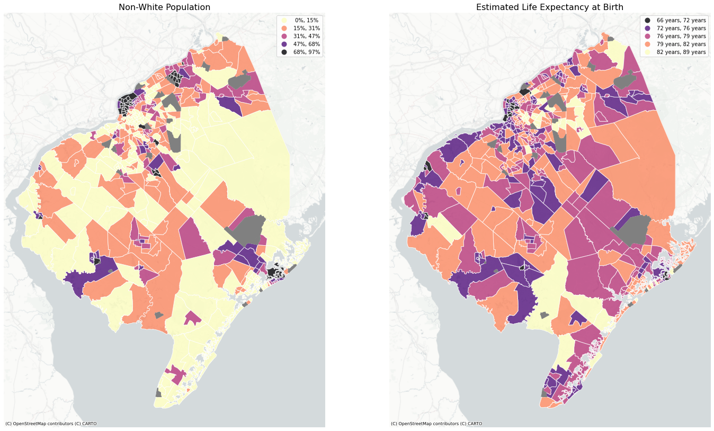
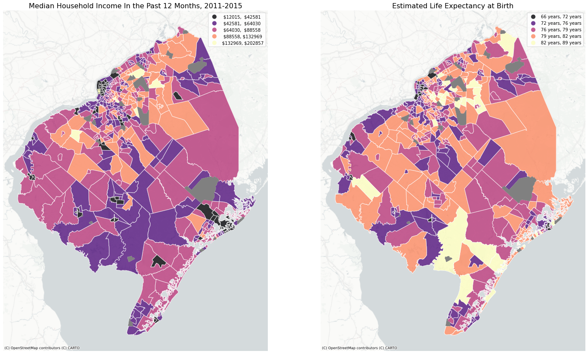
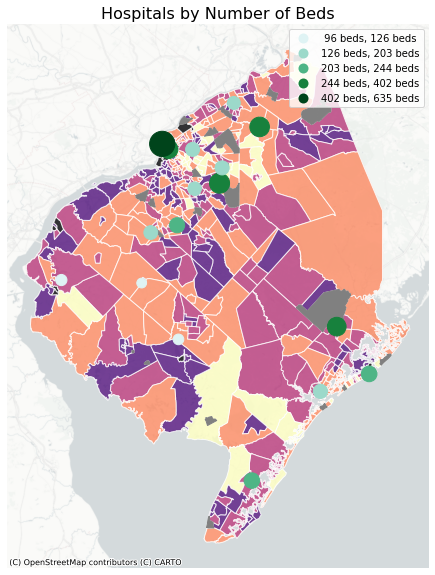

A brief analysis of possible correlation between several geographic variables and life expectancy at birth, as collected by the [U.S. Small-area Life Expectancy Estimates Project - USALEEP](https://www.cdc.gov/nchs/nvss/usaleep/usaleep.html). Specifically looking at the census tracts within seven New Jersey counties: Atlantic, Burlington, Camden, Cape May, Cumberland, Gloucester and Salem counties. Though it is something of a hot topic in the state, the census tracts making up this group of counties will herein be known as [South Jersey](https://www.state.nj.us/transportation/about/directory/southregion.shtm).   

# Datasets

Principally, used the U.S. Small-area Life Expectancy Estimates Project as base information. Made use of several American Community Survey (ACS) variables from the 2015 5 Year Estimates: Group B02001: Race, B19013_001: Median Household Income in the Last 12 Months, and B16010_002: Less than High School Graduate. Also used [Hospitals in NJ](https://njogis-newjersey.opendata.arcgis.com/datasets/newjersey::hospitals-in-nj/about) created by the New Jersey Office of GIS. National Historical Geographic Information System (NHGIS) coast clipped census tracts (2010) were used to convey both the census and life expectancy data geogrpahically.   

## (NHGIS) Coast Clipped Census Tracts
From https://www.nhgis.org/. Based on TIGER/Line Files created and publish by the Census Bureau. TIGER/Line Files have been clipped to more accurately reflect the geography of coastal areas. A shapefile with the entire nation's census tracts was downloaded and subsequently filtered down to NJ and the seven target counties. The filtered data was saved as its own GeoJson.    

## U.S. Small-area Life Expectancy Estimates Project - USALEEP
Data retrieved from https://www.cdc.gov/nchs/nvss/usaleep/usaleep.html. USALEEP was created through a partnership of the National Center for Health Statistics, the Robert Wood Johnson Foundation (RWJF), and the National Association for Public Health Statistics and Information Systems (NAPHSIS). Life expectancy estimates were created in two phases, Phase 1 consisted of Census tracts with 6-year total population size of 5,000 or more and at least 1 death in all age groups, for tracts in this category estimates were created purely through the aggregation of vital statistics. In Phase 2, Census tracts with 6-year total population size of 5,000 or more and 1 or more age groups with zero deaths were given life expectancy estimates based on both vital statistics and a statistical model based on Phase 1 tracts. Vital statistics from 2010-2015 were used; population data from the 2010 decennial census and the 2015 ACS 5 Year survey were used to estimate rolling population. Census tracts with 6-year total population size smaller than 5,000 were excluded from the project. Data was downloaded in CSV format and table joined to the NHGIS census tract file using GEOID/Tract ID.    

## ACS 5 Year Estimate 2011-2015
Made use of several Census Tract level variables. Variables were chosen based on a 2020, [Quantifying and explaining variation in life expectancy at census tract, county, and state levels in the United States](https://www.pnas.org/doi/10.1073/pnas.2003719117), by Boing et al.. This study found that "CT-level socioeconomic and demographic variables explained more than 70% of the between-state variance, 50% of the between-county variance, and 30% of the between-CT variance for LE at all age groups up to 55 to 64y". 

### Group B02001: Race
My goal was to find the estimated percentage of the population within each Census Tract that was non-white. This group does not seperate white only and white only hispanic. As the Census Bureau only notes how calculate MOE through [aggregation](https://www.census.gov/content/dam/Census/library/publications/2018/acs/acs_general_handbook_2018_ch08.pdf) all non-white variables were summed. This sum was divided by the total population of each Census Tract and then converted to percentage. CV was calculated from another formula on the [previously linked site](https://www.census.gov/content/dam/Census/library/publications/2018/acs/acs_general_handbook_2018_ch08.pdf). This data was imported directly into Google Colab as a list and converted into a dataframe, also table joined to the USALEEP/NHGIS file. Derived data was reliable; no census tracts within the study area had CVs greater than 40%.     

### B19013_001: Median Household Income in the Last 12 Months 
Imported into Google Colab as a list, converted into a dataframe and table joined to the USALEEP/NHGIS file. Data was generally reliable, there were only two census tracts with CVs of over 40%.

### B16010_002: Less than High School Graduate
Imported into Google Colab as a list with B02001_1:Total Population. Both converted into a dataframe. B16010_002 was divided by total population for each census tract and converted to percentage. CV was calculated in the same fashion as Group B02001: Race. This data was also table joined to the USALEEP/NHGIS file. No tract had a CV over 40%.    

## Hospitals in NJ
Retrieved from https://njogis-newjersey.opendata.arcgis.com/datasets/newjersey::hospitals-in-nj/about, and published by the New Jersey Office of GIS. Was last updated on May 14, 2020, definitely not ideal as changes in bed number, the main attribute I used, could have changed a good deal since the pandemic. Hospitals were clipped using the filtered pre-USALEEP join NHGIS census tract file. I also did a 5-mile buffer around South Jersey hospitals to see if there was any correlation between proximity to hospital and life expectancy. 

# Static Maps
## Population with Less Than A High School Education and Life Expectancy

Gray census tracts represent those where there was no life expectancy estimate. All tracts had Education data.

| Dep. Variable        | R-squared          | Adj. R-squared |
|:-------------|:------------------|:------|
| 	Estimated Life Expectancy at Birth          | 0.650 | 0.650  |

## Non-White Population and Life Expectancy

Gray census tracts represent those where there was no life expectancy estimate. All tracts had race data.

| Dep. Variable        | R-squared          | Adj. R-squared |
|:-------------|:------------------|:------|
| 	Estimated Life Expectancy at Birth          | 0.557 | 0.556  |

## Median Household Income and Life Expectancy

Gray census tracts represent those where there was no life expectancy estimate. All tracts had income data. Tracts with CVs greater than 40 are hatched, however are quite small. 

| Dep. Variable        | R-squared          | Adj. R-squared |
|:-------------|:------------------|:------|
| 	Estimated Life Expectancy at Birth          | 0.885 | 0.884  |

# Further Regression and Correlation

## Linear Regression Using All Three Variables

| Dep. Variable        | R-squared          | Adj. R-squared |
|:-------------|:------------------|:------|
| 	Estimated Life Expectancy at Birth          | 0.969 | 0.969  |

These three factors can explain nearly all variation in life expectancy. 

## Correlation

|         | Percent of Population with Less Than A High School Education         | Percent of Population that is Non-White| Median Household Income In the Past 12 Months |
|:-------------|:------------------|:------|:------|
| 	Estimated Life Expectancy at Birth          | -0.582036	 | -0.453426	  | 0.608925|

There is negative correlation between Percent of Population with Less Than A High School Education  and Percent of Population that is Non-White and Life Expectancy. Household income has a positive correlation. Tracts with high minority and uneducated populations generally have worse life expectancy estimates.  

## Hospitals By Number of Beds

Map of Hospitals clipped by South Jersey Census Tracts. Marker size is proportional to number of beds in each hospital. 
 
 # Webmap
Hospital Layer, 5 Mile Buffer Around Hospitals and Census Tracts without Life Expectancy estimates can be toggled in the layer controller. The hospital layer shows markers proportional to number of hospital beds, a tooltip shows the actual number of beds. Clicking on a hospital marker gives its name and address as a popup. The non-toggleable life expectancy choropleth shows tract name and life expectancy estimate as a tooltip and Median Household Income in the Last 12 Months, Percent Non-White Population, and Percent of Population with Less Than A High School Education as a popup. The basemap can also be swapped to show a satellite view.   

<iframe src="Final_Webmap.html" height="1000" width="1000"></iframe>

